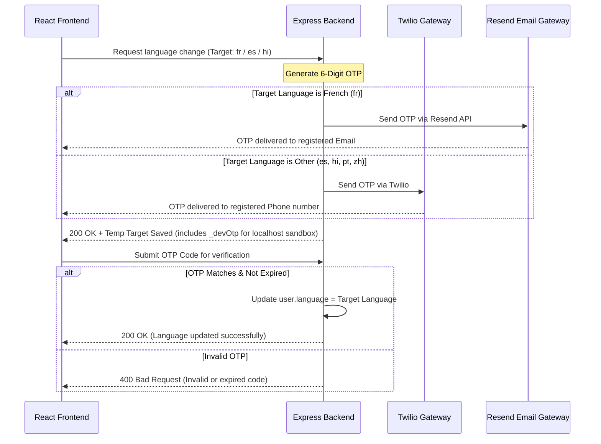

# 🚀 ConnectSphere (Elevance Skills) - Complete Project Report & Reference Manual

Welcome to the official, final project report for **ConnectSphere (Elevance Skills)**. This document explains the entire project, its file structure, key features, database models, and operational flows in simple and easy-to-understand terms.

---

## 📖 Quick Summary (High-Level Overview)

**ConnectSphere** is a modern **Developer Q&A and Social Networking Platform**. It functions as a unique combination of StackOverflow and LinkedIn/Facebook, specifically designed for developers and learners. The key modules operate as follows:

1. **🔒 Secure Login & Authentication**: Users can log in using traditional email-password credentials or Google OAuth. For added security, mobile device logins are restricted to a specific access window of **10:00 AM to 1:00 PM IST**. Active user sessions (tracking IP address, Browser, OS) are also logged and managed.
2. **🌐 Secure Multi-Language & Glassmorphic UI**: The application supports six languages (English, Spanish, Hindi, Portuguese, Chinese, and French). Switching languages requires **OTP verification**:
   * French switches send an OTP to the user's registered **Email** (using the **Resend API**).
   * Other languages send an OTP to the user's registered **Mobile Number** via SMS (using the **Twilio API**).
   * *Developer Assistant*: To ease offline testing, a local banner displaying the `_devOtp` code is shown on screen, allowing immediate copy-pasting.
3. **💻 Developer Q&A Feed (StackOverflow Style)**: Users can post programming-related questions using a rich Markdown editor. Questions can be grouped using tags, and users can comment or submit answers. The question author can mark the best answer as the **"Accepted Answer"**, which pins it.
4. **🤝 Mutual Connections & Social Space**: A dedicated feed (`/social`) displays social updates. Posting here is restricted by the number of mutual friends:
   * 0 Friends: Posting is blocked.
   * 1 Friend: Maximum of 1 post per day.
   * 2–10 Friends: Maximum of 2 posts per day.
   * >10 Friends: Unlimited posting.
5. **🏆 Reputation & Gamification Engine**:
   * Having a question upvoted rewards the author with **+10** points, while a downvote deducts **-2** points.
   * Marking an answer as accepted rewards the answer author with **+15** points and the question asker with **+2** points.
   * If a user's reputation balance is greater than 10, they can transfer reputation points directly to other users.
6. **💳 Subscriptions & Razorpay Time Window**: Daily question posting limits are controlled by subscription plans:
   * **Free**: 1 question/day
   * **Bronze**: 5 questions/day (Cost: ₹100/month)
   * **Silver**: 10 questions/day (Cost: ₹300/month)
   * **Gold**: Unlimited questions/day (Cost: ₹1000/month)
   * **Restricted Payment Hour**: Plan upgrades or purchases via Razorpay can only be conducted between **10:00 AM and 11:00 AM IST** daily. The platform blocks transaction creation outside this hour.

---

## 🛠️ Complete Technical Architecture

ConnectSphere is built on the **MERN (MongoDB, Express, React, Node.js) Stack**. Below is the detailed folder structure and file layout.

### 1. Folder Structure (Directory Layout)

```text
Elevance_Skills/ (Root Directory)
├── backend/                       # Server-side Application (Node.js & Express)
│   ├── src/
│   │   ├── config/                # Configurations (db.js - Database connection & optimization)
│   │   ├── controllers/           # Controllers (Auth, Users, Posts, Connections)
│   │   ├── middleware/            # Security & Validation route guards
│   │   ├── models/                # MongoDB Database Schemas (User.js, Post.js, etc.)
│   │   ├── routes/                # Express API endpoints
│   │   ├── utils/                 # Utility scripts (sendEmail.js, sendSMS.js)
│   │   └── index.js               # Backend Entrypoint (CORS logic, Self-ping Keep-Alive)
│   ├── uploads/                   # Local folder to store user uploaded avatars
│   ├── .env                       # Backend secret environment variables
│   └── package.json               # Backend dependencies
│
├── frontend/                      # Client-side UI Application (React 19 & Vite)
│   ├── public/                    # Static assets (favicon.png, logo)
│   ├── src/
│   │   ├── assets/                # CSS, logo files, and images
│   │   ├── components/            # Shared UI components (Navbar, Sidebar, Modals)
│   │   ├── contexts/              # Global context state (Language, Theme Providers)
│   │   ├── locales/               # Translation dictionary (translations.js)
│   │   ├── pages/                 # Full pages (Feed, AskQuestion, Profile, Settings)
│   │   ├── routes/                # React Router DOM configuration
│   │   ├── services/              # API Client (Axios calls to backend)
│   │   ├── store/                 # Redux Toolkit setup
│   │   ├── App.jsx                # Main Application component
│   │   └── main.jsx               # React DOM rendering start point
│   ├── index.html                 # App HTML skeleton
│   └── package.json               # Frontend dependencies
│
└── reports/                       # Dev Progress reports
```

---

## 📂 Key Code Components & Database Models

### 🗃️ Database Schemas (MongoDB)

#### 1. User Model (`backend/src/models/User.js`)
Saves credentials, profile configurations, active settings, and security status:
* **Authentication fields**: `email`, `password` (hashed with bcrypt), `googleId` (for Google OAuth).
* **Multi-Language Swapping**:
  * `language`: Active preferred language (`en`, `es`, `hi`, `pt`, `zh`, `fr`).
  * `tempLanguageSwapCode`: Current pending 6-digit OTP code.
  * `tempLanguageSwapExpires`: Expiration timestamp of the OTP (15 minutes).
  * `tempLanguageSwapTarget`: Target language that will be set upon OTP verification.
* **Email & Phone Verification**:
  * `isEmailVerified` (Boolean) & `emailVerificationCode` (String).
  * `isPhoneVerified` (Boolean) & `phoneVerificationCode` (String).
* **Reputation Engine**: `reputation` (Integer, default `0`).
* **Active Sessions log**: `activeSessions` (Array of objects storing `ip`, `userAgent`, `os`, `browser`, `lastActive`).
* **Rate Limits**: `lastForgotPasswordRequest` (Date timestamp to restrict password resets to once per day).

#### 2. Post Model (`backend/src/models/Post.js`)
Saves and distinguishes Questions, Answers, and Social posts:
* **Content fields**: `title`, `content` (supports Markdown strings), `tags` (Array).
* **Type flags**:
  * `isSocial`: Set to `true` for social space updates, `false` for technical developer Q&As.
* **Interactive components**:
  * `author`: Reference link to user model.
  * `upvotes` & `downvotes`: Arrays of User ID references (enforces no self-voting and prevents multiple votes).
  * `bookmarks` & `shares`: Counters and references.
  * `comments` (Answers): Nested comments containing text content, user references, voting configurations, and an `isAccepted` (Boolean) flag.

---

## 🔒 Advanced Logic Flows Explained

### 🔑 A. Multilingual Verification Flow
To switch the UI language safely and prevent automated script abuse, the system executes a 2-step verification flow:



### 🤝 B. Friend System & Social Space Posting Limits
To keep the Social space feed engaging and free of spam, daily post creation limits are dynamic:
* The connection schema maps active mutual links where status is `'accepted'` between two unique users.
* When a user attempts to create a post with `isSocial: true`:
  1. The backend counts the user's mutual friend connections.
  2. If the count is **0**: Block post creation.
  3. If the count is **1**: Check posts made today. If post count >= 1, return `400 Bad Request: "Daily limit exceeded"`.
  4. If the count is **2 to 10**: If posts made today >= 2, return `400 Bad Request: "Daily limit exceeded"`.
  5. If the count is **>10**: Allow unlimited posts.

### 🏆 C. Reputation Calculations
Points are awarded and deducted dynamically based on user activities:
| Action | Point Modifier | Target |
| :--- | :--- | :--- |
| **Upvote Question/Answer** | `+10` points | Author of the Question/Answer |
| **Downvote Question/Answer** | `-2` points | Author of the Question/Answer |
| **Answer reaches 5 Upvotes** | `+5` points | Bonus to the Answer's author |
| **Answer marked as Accepted** | `+15` to Author, `+2` to Asker | Both participants are rewarded |
| **Point Transfer** | `-X` to sender, `+X` to receiver | Transfer allowed if sender balance > 10 |

---

## ⚡ Recent Critical Optimizations & Fixes

Here are the premium changes applied recently to ensure high reliability and zero-latency execution:

1. **🚀 Remote Database Speedups**:
   * Resolved a 7-10s connection lag to remote MongoDB Atlas clusters by adding `dns.setDefaultResultOrder('ipv4first')` in the backend entry point and specifying `{ family: 4 }` inside the Mongoose connection options. This forces IPv4 resolution, reducing cluster handshake times to less than **1.5 seconds**.
2. **📨 Resend API Integration**:
   * Upgraded the email dispatch module from classic SMTP/Nodemailer settings to a native HTTP API call via the **Resend API** (`https://api.resend.com/emails`).
   * Configured the verified sending domain `no-reply@connectsphere.anshuman892494.online` to ensure successful delivery to inboxes.
3. **🖼️ Upload Profile Image & URL Input**:
   * Redesigned the edit profile modal into a tabbed layout. Users can upload image files directly (stored inside `backend/uploads/`) or input external image URLs.
4. **💳 Razorpay Dynamic SDK Injection**:
   * Instead of loading the Razorpay script globally (which triggers warnings and reduces web speed), the script is dynamically injected *only* when the subscription tab renders, and is automatically removed from the DOM on unmount.
5. **📱 Site-wide Responsive Overhaul**:
   * Navbar items automatically hide/collapse on devices `< 640px` (trophy badge counts, brand logos, etc.).
   * The sidebar transforms into a floating element, and question vote widgets shift into a space-efficient horizontal layout on mobile displays.
6. **🔄 Render Free Tier Keep-Alive**:
   * Programmed a background service worker to ping its own `/ping` route every 10 minutes, keeping the backend container active and preventing cold-start delays.

---

## ⚙️ Environment Variables Setup (`.env`)

Create a `.env` file in `backend/` and configure these variables:

```env
# Server details
PORT=5000
NODE_ENV=production

# Database URI (MongoDB Atlas or Local MongoDB)
MONGO_URI=mongodb+srv://<username>:<password>@cluster.mongodb.net/ConnectSphere

# JSON Web Token Secret Key
JWT_SECRET=your_jwt_signing_secret_key

# Cloudinary Integration (for image storage)
CLOUDINARY_CLOUD_NAME=your_cloudinary_cloud_name
CLOUDINARY_API_KEY=your_cloudinary_api_key
CLOUDINARY_API_SECRET=your_cloudinary_api_secret

# Razorpay Payments SDK
RAZORPAY_KEY_ID=rzp_test_your_razorpay_key
RAZORPAY_KEY_SECRET=your_razorpay_secret_key

# Resend API (For transactional emails/OTP)
RESEND_API_KEY=re_your_resend_api_key
EMAIL_FROM="ConnectSphere <no-reply@your_verified_domain.com>"

# Google OAuth2 Credentials
GOOGLE_CLIENT_ID=your_google_oauth_client_id

# Twilio SMS API Configuration (For SMS OTP)
TWILIO_ACCOUNT_SID=your_twilio_sid
TWILIO_AUTH_TOKEN=your_twilio_token
TWILIO_PHONE_NUMBER=your_twilio_registered_number
```

---

## 🚀 How to Run the Project Locally

Follow these quick commands to fire up both the frontend and backend servers on your local computer:

### 📡 1. Starting the Backend Server
```bash
cd backend
# 1. Install dependencies
npm install

# 2. Run in development mode (launches backend at http://localhost:5000)
npm run dev
```

### 💻 2. Starting the Frontend App
```bash
cd frontend
# 1. Install dependencies
npm install

# 2. Run the Vite React application (launches frontend at http://localhost:5173)
npm run dev
```

Your system is now ready for local exploration! Use the developer helpers visible on the screen to bypass SMS/Email gateways and quickly test the custom validation logic.

---